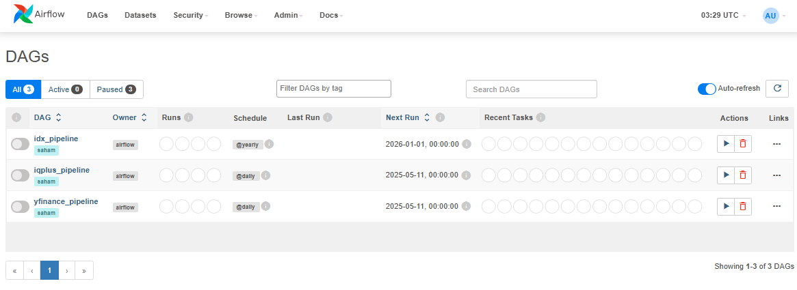

# ETL Saham Pipeline with Airflow & Docker
## Anggota
- Mochamad Zidan Rusdhiana (2305464)
- Muhammad Daffa Ma'arif (2305771)
- Yusrilia Hidayanti (2306828)
- Ismail Fatih Raihan (2307840)
- Hafsah Hamidah (2311474)

## Deskripsi
Proyek ini merupakan pipeline ETL (Extract, Transform, Load) data saham yang dibangun menggunakan **Apache Airflow**, **Docker**, dan **Python**. Tujuannya adalah untuk mengotomatisasi proses pengambilan, transformasi, dan pemuatan data saham ke dalam database MongoDB agar dapat diakses oleh aplikasi analisis dan visualisasi data.

Setiap komponen ETL (extract, transform, load) dipisahkan dalam container Docker agar modular, efisien, dan mudah diorkestrasi melalui DAG pada Airflow.

---

## Struktur Direktori

```
ETL-Task/
├── airflow/           # Konfigurasi DAG dan skrip Airflow
├── api/               # Backend API untuk menyajikan data ke frontend
├── dashboard/         # Frontend dashboard (React/Next.js - TypeScript/TSX)
├── extract/           # Scraping data dari IDX, IQPlus, YFinance
│   ├── idx_scraper.py
│   ├── iqplus_scraper.py
│   ├── yfinance_scraper.py
│   └── Dockerfile
├── load/              # Load data ke MongoDB
│   ├── loader.py
│   ├── yfinance_loader.py
│   └── Dockerfile
├── output/            # Penyimpanan data sementara hasil extract & transform
├── transform/         # Transformasi data saham
│   ├── transform_idx.py
│   ├── transform_iqplus.py
│   └── Dockerfile
├── .gitignore
├── docker-compose.yml
└── README.md
```

---

## Alur ETL

### 1. Extract

Data saham diambil dari:

* **IDX**: Data saham Indonesia dari situs resmi Bursa Efek Indonesia.
* **IQPlus**: Berita ekonomi dan saham.
* **YFinance**: Data harga pasar saham secara global dari Yahoo Finance.

Setiap scraper dijalankan dalam container-nya masing-masing menggunakan Dockerfile yang seragam.

### 2. Output

Hasil scraping disimpan dalam format JSON/CSV di dalam folder `output/` sebagai intermediate storage.

### 3. Transform

Transformasi dilakukan untuk data `idx` dan `iqplus`, meliputi:

* Pembersihan data duplikat atau null
* Normalisasi format tanggal
* Konversi ke struktur yang seragam

Hasil transformasi juga disimpan kembali ke `output/`.

### 4. Load

Semua data akhir dimuat ke MongoDB menggunakan container `load`.

---

##  DAGs (Airflow Pipelines)

Pipeline ETL didefinisikan dalam folder `airflow/dags`. Tiga DAG utama adalah:

| DAG Name            | Deskripsi                                     |
| ------------------- | --------------------------------------------- |
| `yfinance_pipeline` | Menjalankan yfinance extract → load           |
| `idx_pipeline`      | Menjalankan idx extract → transform → load    |
| `iqplus_pipeline`   | Menjalankan iqplus extract → transform → load |

Setiap task DAG berjalan di container terpisah agar proses lebih efisien dan terisolasi.
Berikut adalah tampilan Airflow:


---

##  Services (docker-compose)

Berikut adalah layanan-layanan yang didefinisikan di `docker-compose.yml`:

* **airflow\_scheduler**: Menjalankan dan menjadwalkan DAG
* **airflow\_webserver**: UI web Airflow (akses di [http://localhost:8080](http://localhost:8080))
* **postgres**: Backend database metadata Airflow
* **api**: REST API backend (FastAPI atau Flask) untuk menyajikan data
* **dashboard**: Frontend berbasis TypeScript/React/TSX
* **Container per task DAG**:

  * `idx_extract`, `iqplus_extract`, `yfinance_extract`
  * `transform_idx`, `transform_iqplus`
  * `load`

---

## API Endpoint

API akan menyajikan data yang sudah dimuat ke MongoDB. Contoh endpoint:

```
GET /api/harga?/emiten={nama emiten}&period{daily/monthly/yearly}
GET /api/emiten
GET /api/idx/finance?entity_code=<emiten_code>
GET /api/idx/
GET /api/iqplus/
GET /api/iqplus/recent?hours=<hour>
GET /api/iqplus/emiten/<emiten_code>

```

---

## Dashboard

Frontend dashboard menggunakan Next.js (TypeScript/TSX) yang akan:

* Menampilkan grafik harga saham
* Filter data berdasarkan emiten & periode
* Visualisasi berita dari IQPlus

Dashboard mengambil data dari endpoint API dan menampilkannya secara interaktif.

---

##  Menjalankan Proyek

1. Build semua Docker image:

```bash
docker-compose build
```

2. Jalankan semua service:

```bash
docker-compose up -d
```

3. Akses Airflow UI:

```
http://localhost:8080
```

4. Akses API:

```
http://localhost:5000
```

5. Akses dashboard:

```
http://localhost:3000
```

---

##  Dokumentasi Web Dashboard


https://github.com/user-attachments/assets/9a0549c7-02fa-4c80-b1e5-c130302220a0


---

##  Output

Data hasil extract dan transform disimpan di folder `output/`, lalu dimuat ke MongoDB oleh container `load`. Format file umumnya adalah JSON, namun khusus untuk data hasil scrapping IDX, format file adalah XBRL.

---
